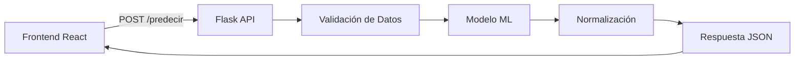

# Backend del Juego Interactivo de Ecuador

## 📋 Descripción

API Flask que proporciona predicciones de puntuación inteligente para el juego educativo de geografía ecuatoriana utilizando Machine Learning.

## 🚀 Características

- **Predicción con ML**: Modelo entrenado para calcular puntuaciones basadas en múltiples factores
- **Validación robusta**: Verificación completa de datos de entrada
- **Manejo de errores**: Respuestas claras y códigos de error específicos
- **CORS configurado**: Acceso desde frontend React
- **Endpoints de testing**: Herramientas para verificar funcionamiento

## 🔧 Instalación

### Requisitos
```bash
Python 3.8+
pip install flask flask-cors scikit-learn pandas joblib
```

### Configuración
```bash
cd backend/
pip install -r requirements.txt
python app.py
```

## 📡 API Endpoints

### 🎯 POST /predecir
**Predicción principal de puntuación**

```json
// Petición
{
  "tiempo_respuesta": 12.5,     // Tiempo en segundos (requerido)
  "edad": 10,                   // Edad 3-18 años (requerido)
  "vidas_usadas": 1,            // Vidas gastadas 0-3 (requerido)
  "es_correcto": 1,             // 1=correcto, 0=incorrecto (requerido)
  "provincia_dificultad": 3     // Dificultad 1-5 (opcional, default=3)
}

// Respuesta exitosa (200)
{
  "puntos_estimados": 15,       // Puntos para el juego
  "puntos_raw": 156.78,         // Puntos brutos del modelo
  "normalizado": true           // Indica normalización aplicada
}
```

### 🏥 GET /health
**Verificación de estado del servidor**

```json
{
  "status": "OK",
  "modelo_disponible": true,
  "mensaje": "Backend funcionando correctamente",
  "endpoints": {...}
}
```

### 📝 GET /ejemplo
**Datos de ejemplo para testing**

```json
{
  "ejemplo_peticion": {...},
  "campos_requeridos": [...],
  "campos_opcionales": [...],
  "respuesta_esperada": {...}
}
```

### 🧪 POST /test
**Test automático del modelo**

Ejecuta una predicción con datos predefinidos para verificar que el modelo funciona.

## 🎲 Factores del Modelo ML

### Entrada del Modelo
| Factor | Tipo | Rango | Descripción |
|--------|------|-------|-------------|
| `tiempo_respuesta` | float | 0+ | Segundos para responder |
| `provincia_dificultad` | int | 1-5 | Dificultad de la pregunta |
| `edad` | int | 3-18 | Edad del jugador |
| `vidas_usadas` | int | 0-3 | Vidas gastadas antes de responder |
| `es_correcto` | int | 0,1 | Si la respuesta fue correcta |

### Dificultad de Provincias
```python
# Escala 1-5: 1=Muy Fácil, 5=Muy Difícil
PROVINCE_DIFFICULTY = {
    "Pichincha": 1,      # Quito es muy conocido
    "Guayas": 1,         # Guayaquil es muy conocido
    "Galápagos": 2,      # Famoso internacionalmente
    "Azuay": 2,          # Cuenca conocida
    "Esmeraldas": 3,     # Medianamente conocida
    "Sucumbíos": 5,      # Amazonia menos conocida
    # ... resto de provincias
}
```

## 🔄 Flujo de Datos



## ⚠️ Manejo de Errores

### Códigos de Error
- **400**: Datos faltantes o inválidos
- **500**: Error del modelo o servidor interno

### Ejemplos de Errores
```json
// Campo faltante
{
  "error": "Campos faltantes: tiempo_respuesta",
  "codigo": "MISSING_FIELDS",
  "campos_requeridos": [...]
}

// Dato inválido
{
  "error": "edad debe estar entre 3 y 18 años",
  "codigo": "INVALID_DATA_TYPES"
}

// Modelo no disponible
{
  "error": "Modelo no disponible",
  "codigo": "MODEL_NOT_LOADED"
}
```

## 📊 Logging del Sistema

El backend incluye logging detallado:

```
✅ Modelo cargado correctamente
📩 Datos recibidos: {...}
📊 Dificultad para Pichincha: 1
🔄 Datos procesados para el modelo: {...}
ℹ️ Usando dificultad por defecto (3) - provincia_dificultad no enviada
🤖 Predicción raw: 156.78, normalizada: 16
```

## 🧪 Testing

### Probar Manualmente
```bash
# Test de salud
curl http://localhost:5000/health

# Test automático
curl -X POST http://localhost:5000/test

# Test con datos reales
curl -X POST http://localhost:5000/predecir \
  -H "Content-Type: application/json" \
  -d '{
    "tiempo_respuesta": 10.5,
    "edad": 12,
    "vidas_usadas": 1,
    "es_correcto": 1,
    "provincia_dificultad": 3
  }'
```

### Testing desde Frontend
El frontend envía automáticamente los datos al endpoint `/predecir` durante el juego.

## 🔧 Configuración Avanzada

### Variables de Entorno
```bash
FLASK_ENV=development
FLASK_DEBUG=True
CORS_ORIGINS=http://localhost:3000,http://localhost:5173
```

### Puertos y URLs
- **Desarrollo**: `http://localhost:5000`
- **Frontend React**: `http://localhost:3000`
- **Frontend Vite**: `http://localhost:5173`

## 📂 Estructura de Archivos

```
backend/
├── app.py                 # API principal
├── requirements.txt       # Dependencias Python
├── models/
│   └── modelo_puntos.pkl  # Modelo ML entrenado
└── data/
    └── datos_juego.xlsx   # Datos de entrenamiento
```

## 🚀 Deployment

### Desarrollo
```bash
python app.py
```

### Producción
```bash
gunicorn -w 4 -b 0.0.0.0:5000 app:app
```

## 🤝 Integración con Frontend

El frontend (React) se comunica con este backend a través de:

1. **Inicio de juego**: GET /health para verificar disponibilidad
2. **Durante el juego**: POST /predecir para cada respuesta
3. **Debugging**: GET /ejemplo para datos de prueba

---

**Desarrollado para el Sistema Educativo Ecuador** 🇪🇨
